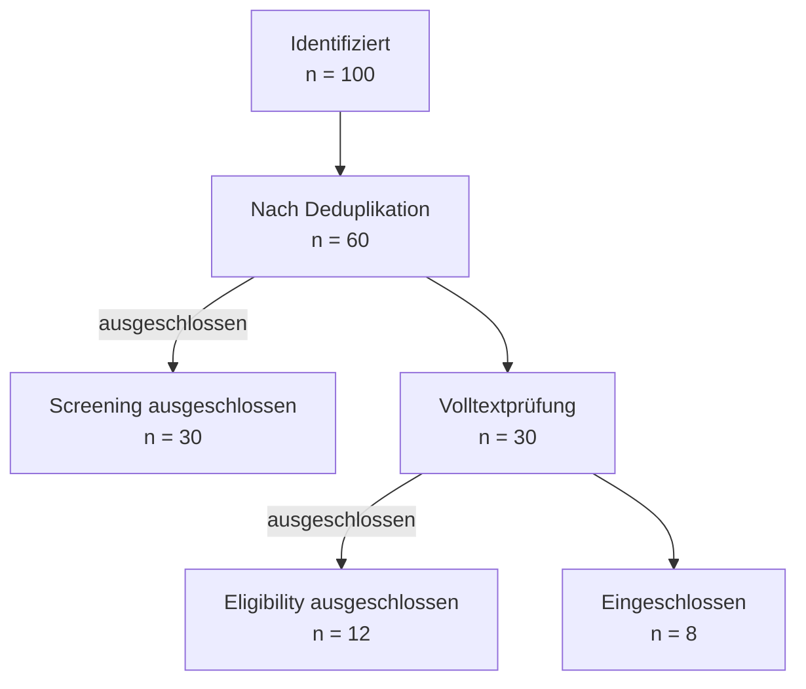

# PRISMA-Flow

> **Gemeinsames Preamble laden:** Lies `skills/_common/preamble.md`
> und befolge alle dort definierten Blöcke (Vorbedingungen, Keine Fabrikation,
> Aktivierung, Abgrenzung), bevor du mit diesem Skill-spezifischen Inhalt
> fortfährst.

## Übersicht

Dieser Skill erzeugt ein standardkonformes PRISMA 2020 Flow-Diagramm (Mermaid)
aus den PRISMA-Zählern einer `/search`-Session und fügt es in das
Methodikkapitel ein.

## PRISMA-Zähler

Die folgenden Zähler werden von `/search` in `$SESSION_DIR/prisma_counters.json`
gespeichert:

| Zähler | Bedeutung |
|--------|-----------|
| `n_identified` | Gesamtzahl identifizierter Treffer (alle Module summiert) |
| `n_after_dedup` | Nach Deduplikation verbleibende Records |
| `n_excluded_screening` | Beim Titel/Abstract-Screening ausgeschlossen (relevance-scorer < 0.5) |
| `n_excluded_eligibility` | Bei der Volltextprüfung ausgeschlossen (quality-reviewer: Reject) |
| `n_included` | Schließlich eingeschlossene Studien |

## Workflow

### Schritt 1: Zähler laden

```python
import json, pathlib

session_dir = "$SESSION_DIR"  # aus /search Session
counters = json.loads(
    pathlib.Path(f"{session_dir}/prisma_counters.json").read_text()
)
```

Alternativ: Wenn kein `prisma_counters.json` vorhanden, den User um die
Zählwerte bitten oder aus dem angezeigten Ergebnis-Summary ableiten.

### Schritt 2: Mermaid-Diagramm rendern

```bash
~/.academic-research/venv/bin/python \
  ${CLAUDE_PLUGIN_ROOT}/skills/prisma-flow/scripts/render_flow.py \
  --n-identified ${N_IDENTIFIED} \
  --n-after-dedup ${N_AFTER_DEDUP} \
  --n-excluded-screening ${N_EXCLUDED_SCREENING} \
  --n-excluded-eligibility ${N_EXCLUDED_ELIGIBILITY} \
  --n-included ${N_INCLUDED} \
  --output kapitel/methodik.md
```

Oder per Python-API:

```python
from skills.prisma_flow.scripts.render_flow import render_prisma_flow
mermaid = render_prisma_flow(counters, output_path="kapitel/methodik.md")
```

### Schritt 3: Integration in kapitel/methodik.md

Das Skript hängt den Mermaid-Block automatisch an `kapitel/methodik.md` an.
Falls die Datei nicht existiert, wird sie angelegt.

Das generierte Diagramm hat folgende Struktur:

```
Identifiziert (n = X)
        ↓
Nach Deduplikation (n = Y)
        ↓ ausgeschlossen (n = Z)
Volltextprüfung (n = W)
        ↓ ausgeschlossen (n = V)
Eingeschlossen (n = U)
```

### Schritt 4: PRISMA-Checkliste anzeigen (optional)

Auf Wunsch des Users die 27-Punkte-PRISMA-2020-Checkliste anzeigen:

```bash
cat ${CLAUDE_PLUGIN_ROOT}/skills/prisma-flow/references/prisma-checklist.md
```

## Beispiel-Output (Mermaid)



## Wichtige Regeln

- **Zähler nie fabrizieren** — Nur Werte aus tatsächlichen Suchergebnissen nutzen
- **Bidirektionale Konsistenz** — `n_after_dedup - n_excluded_screening = Volltextkandidaten`
- **PRISMA-Standard einhalten** — Nummerierung entspricht PRISMA 2020 (Page et al. 2021)
